# Movie Theater App

### Description

A simple movie theater web application.

You can sign in as admin with: login: a@a.pl, password: a.

### Features

**Users can:**
- View screenings, movies, news
- Sign up
- Sign in
- Book movie tickets
- View their bookings

**Admin can:**
- Manage screenings
- Manage movies
- Manage auditoriums
- Manage news

### Screenshots
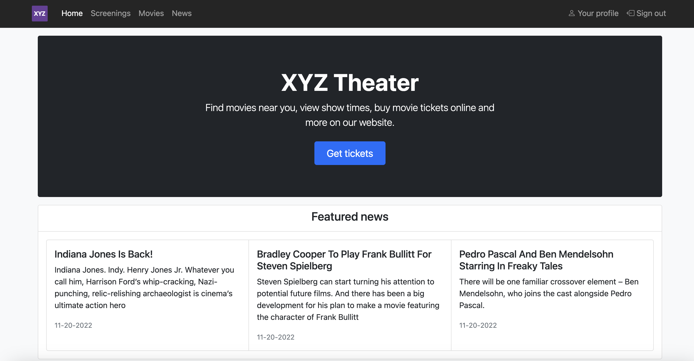
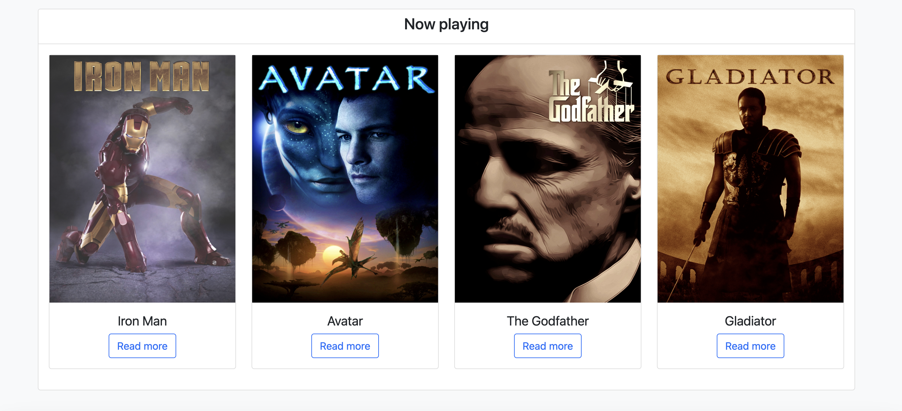
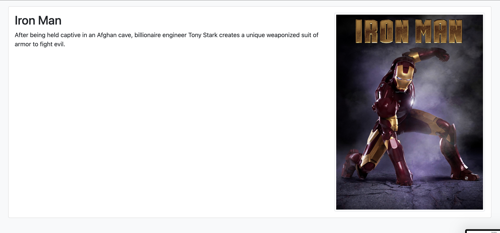
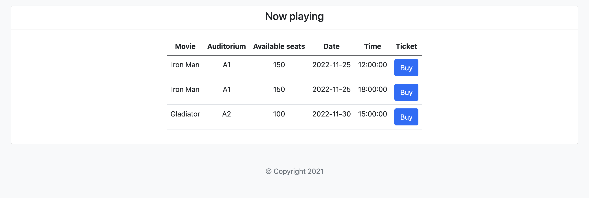
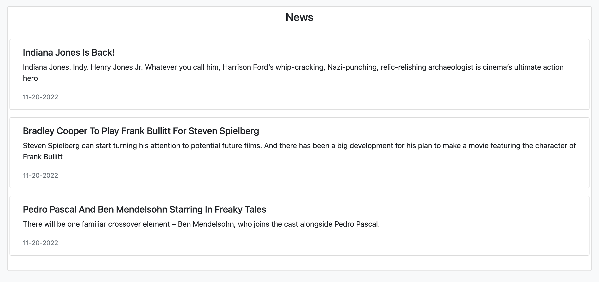
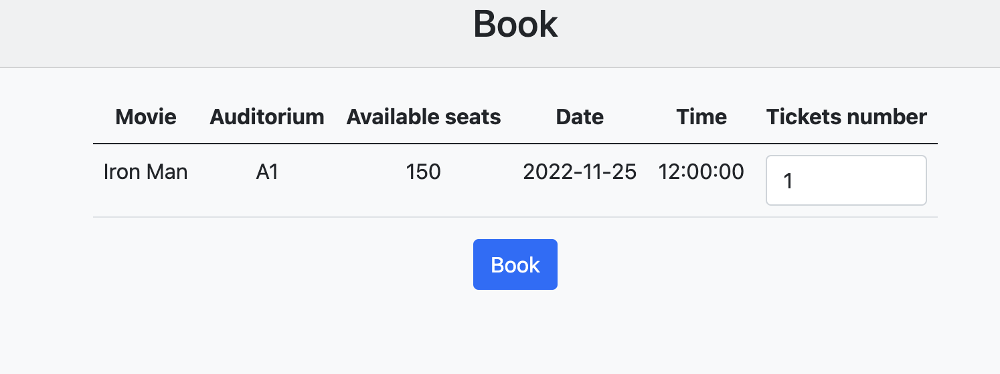
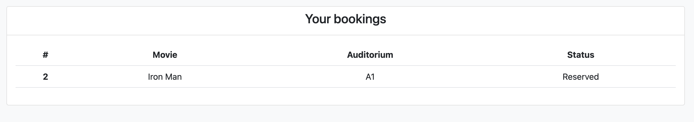
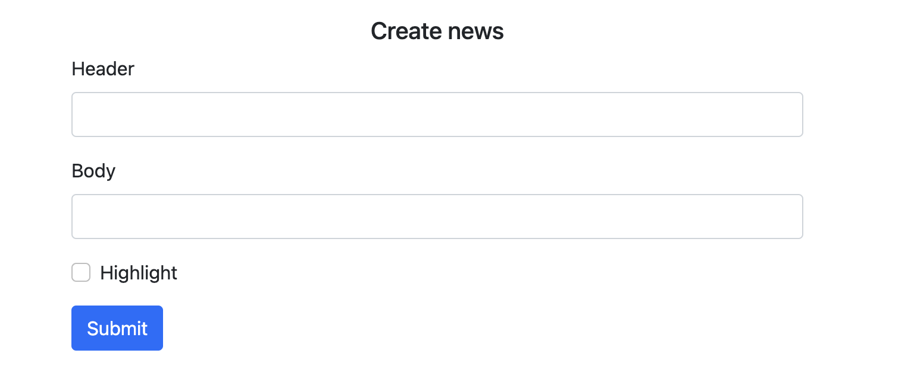
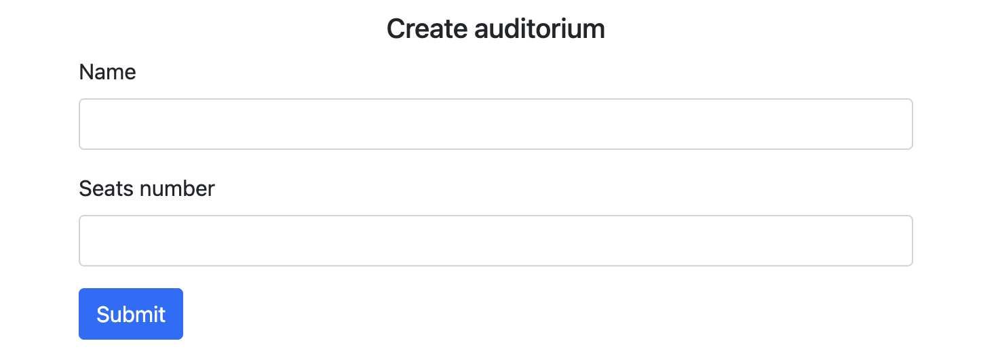
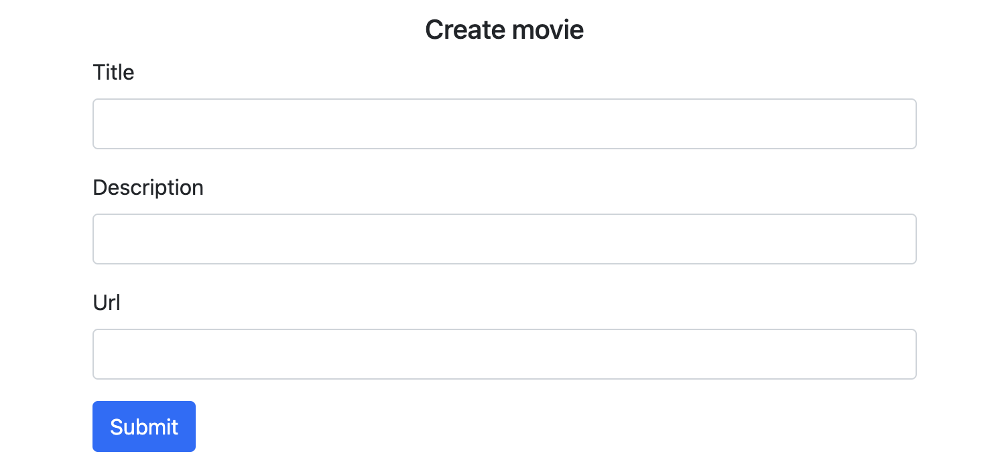
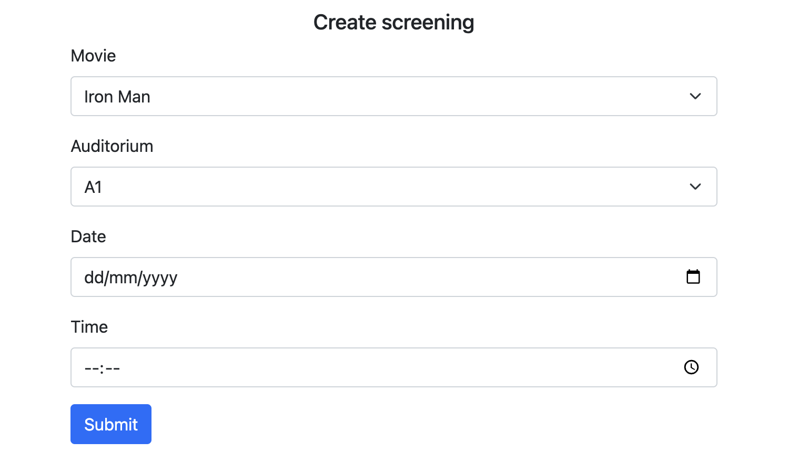
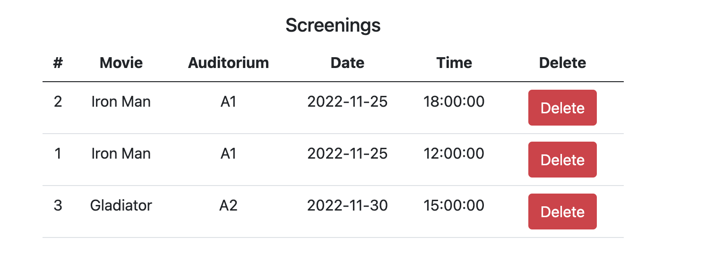

### Technologies
- Java
- Spring Boot
- Spring Security
- Spring Data JPA
- Hibernate
- Thymeleaf
- PostgreSQL
- HTML
- CSS
- Bootstrap
- JavaScript